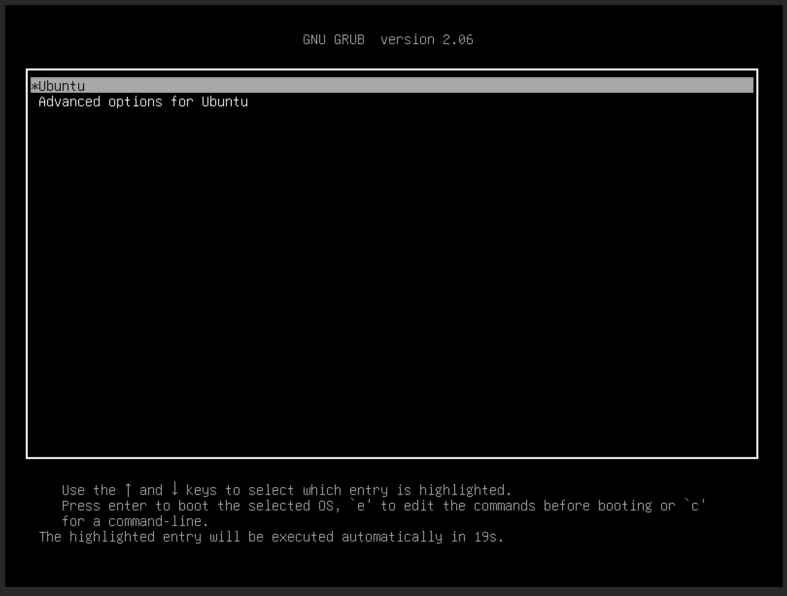
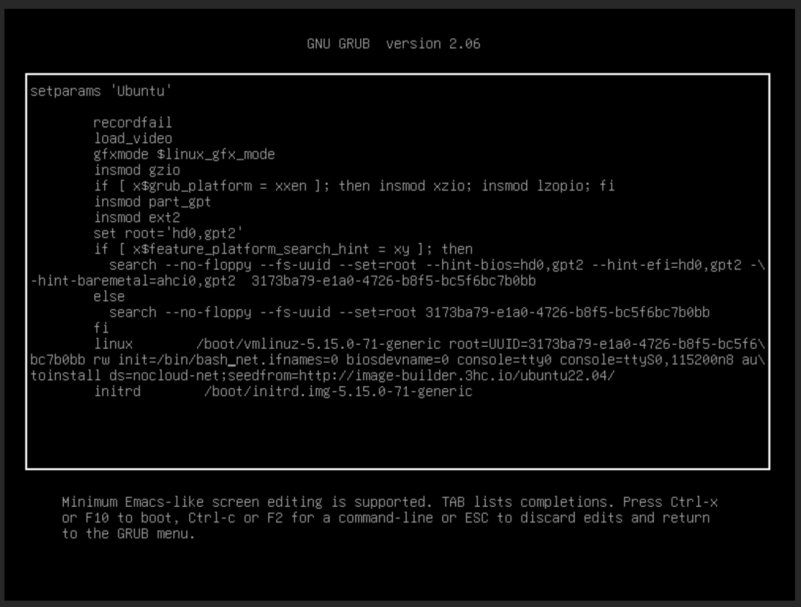
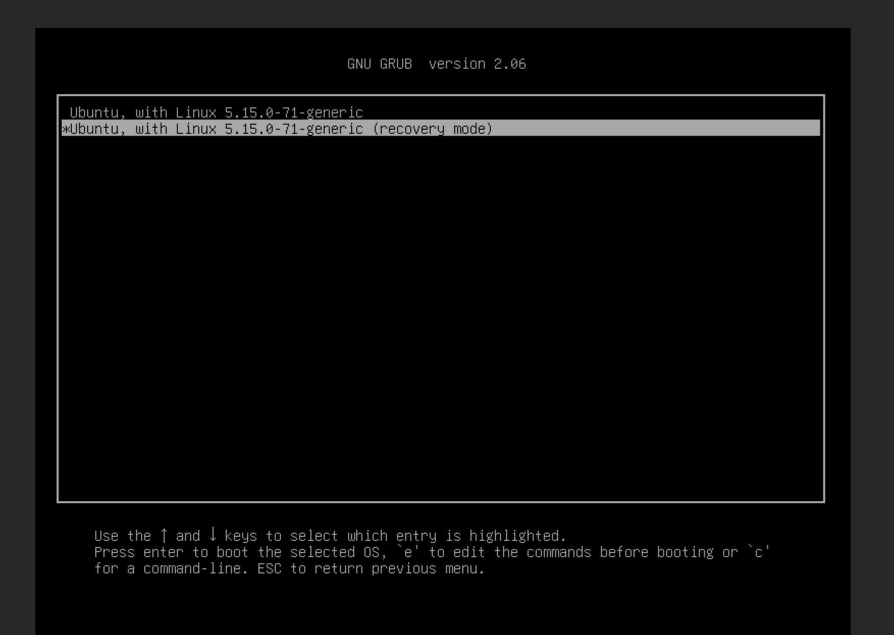
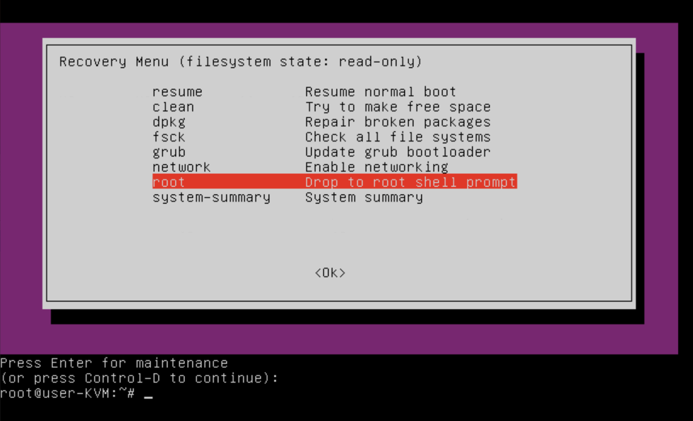
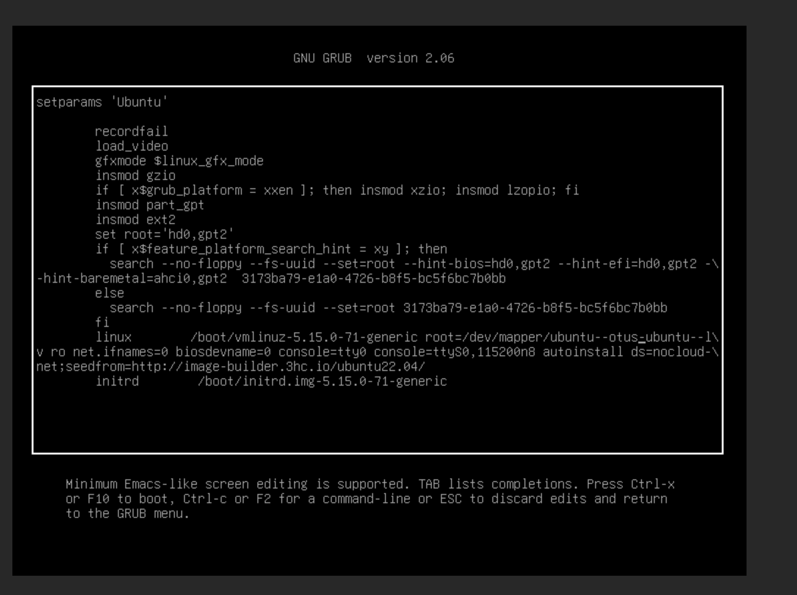

# Домашнее задание 8: Работа с загрузчиком

## Задания
1. Включить отображение меню Grub.
2. Попасть в систему без пароля несколькими способами.
3. Установить систему с LVM, после чего переименовать VG


## Выполнение

### Включить отображение меню Grub:
```
root@otus-homework:~# nano /etc/default/grub

root@otus-homework:~# cat /etc/default/grub
# If you change this file, run 'update-grub' afterwards to update
# /boot/grub/grub.cfg.
# For full documentation of the options in this file, see:
#   info -f grub -n 'Simple configuration'

GRUB_DEFAULT=0
#GRUB_TIMEOUT_STYLE=hidden
GRUB_TIMEOUT=20
GRUB_DISTRIBUTOR=`lsb_release -i -s 2> /dev/null || echo Debian`
GRUB_CMDLINE_LINUX_DEFAULT="autoinstall ds=nocloud-net;seedfrom=http://image-builder.3hc.io/ubuntu22.04/"
GRUB_CMDLINE_LINUX="net.ifnames=0 biosdevname=0 console=tty0 console=ttyS0,115200n8"


root@otus-homework:~# update-grub
Sourcing file `/etc/default/grub'
Sourcing file `/etc/default/grub.d/init-select.cfg'
Generating grub configuration file ...
Found linux image: /boot/vmlinuz-5.15.0-71-generic
Found initrd image: /boot/initrd.img-5.15.0-71-generic
Warning: os-prober will not be executed to detect other bootable partitions.
Systems on them will not be added to the GRUB boot configuration.
Check GRUB_DISABLE_OS_PROBER documentation entry.
done
```



### Попасть в систему без пароля несколькими способами:
добавила init=/bin/bash


через recovery menu



Второй вариант мне кажется комфортнее.

### Установить систему с LVM, после чего переименовать VG:

Перенесла систему на LVM
```
root@otus-homework:~# lsblk
NAME                    MAJ:MIN RM   SIZE RO TYPE MOUNTPOINTS
loop0                     7:0    0  63.3M  1 loop /snap/core20/1822
loop1                     7:1    0 111.9M  1 loop /snap/lxd/24322
loop2                     7:2    0  49.8M  1 loop /snap/snapd/18357
sda                       8:0    0    16G  0 disk 
├─sda1                    8:1    0     1M  0 part 
└─sda2                    8:2    0    16G  0 part 
sdb                       8:16   0    20G  0 disk 
└─ubuntu--vg-ubuntu--lv 253:0    0    17G  0 lvm  /


root@otus-homework:/boot/grub# cat /etc/default/grub | grep -E 'GRUB_CMDLINE_LINUX'
GRUB_CMDLINE_LINUX_DEFAULT="autoinstall ds=nocloud-net;seedfrom=http://image-builder.3hc.io/ubuntu22.04/"
GRUB_CMDLINE_LINUX="net.ifnames=0 biosdevname=0 console=tty0 console=ttyS0,115200n8"


root@otus-homework:/boot/grub# grep -E 'linux.*root=' /boot/grub/grub.cfg
  linux /boot/vmlinuz-5.15.0-71-generic root=/dev/mapper/ubuntu--vg-ubuntu--lv ro net.ifnames=0 biosdevname=0 console=tty0 console=ttyS0,115200n8 autoinstall ds=nocloud-net;seedfrom=http://image-builder.3hc.io/ubuntu22.04/
    linux /boot/vmlinuz-5.15.0-71-generic root=/dev/mapper/ubuntu--vg-ubuntu--lv ro net.ifnames=0 biosdevname=0 console=tty0 console=ttyS0,115200n8 autoinstall ds=nocloud-net;seedfrom=http://image-builder.3hc.io/ubuntu22.04/
    linux /boot/vmlinuz-5.15.0-71-generic root=/dev/mapper/ubuntu--vg-ubuntu--lv ro recovery nomodeset dis_ucode_ldr net.ifnames=0 biosdevname=0 console=tty0 console=ttyS0,115200n8


root@otus-homework:~# vgs
  VG        #PV #LV #SN Attr   VSize   VFree 
  ubuntu-vg   1   1   0 wz--n- <20.00g <3.00g

root@otus-homework:/boot/grub# ls /dev/mapper/
control  ubuntu--vg-ubuntu--lv
```

Переименовываю LVM, меняю везде и проверяю:
```
root@otus-homework:/boot/grub# vgrename ubuntu-vg ubuntu-otus
  Volume group "ubuntu-vg" successfully renamed to "ubuntu-otus"


root@otus-homework:/boot/grub# vgs
  VG          #PV #LV #SN Attr   VSize   VFree 
  ubuntu-otus   1   1   0 wz--n- <20.00g <3.00g


root@otus-homework:/boot/grub# ls /dev/mapper/
control  ubuntu--otus-ubuntu--lv

root@otus-homework:/boot/grub# sudo sed -i 's|ubuntu--vg-ubuntu--lv|ubuntu--otus-ubuntu--lv|g' /boot/grub/grub.cfg

root@otus-homework:/boot/grub# grep -E 'linux.*root=' /boot/grub/grub.cfg
  linux /boot/vmlinuz-5.15.0-71-generic root=/dev/mapper/ubuntu--otus-ubuntu--lv ro net.ifnames=0 biosdevname=0 console=tty0 console=ttyS0,115200n8 autoinstall ds=nocloud-net;seedfrom=http://image-builder.3hc.io/ubuntu22.04/
    linux /boot/vmlinuz-5.15.0-71-generic root=/dev/mapper/ubuntu--otus-ubuntu--lv ro net.ifnames=0 biosdevname=0 console=tty0 console=ttyS0,115200n8 autoinstall ds=nocloud-net;seedfrom=http://image-builder.3hc.io/ubuntu22.04/
    linux /boot/vmlinuz-5.15.0-71-generic root=/dev/mapper/ubuntu--otus-ubuntu--lv ro recovery nomodeset dis_ucode_ldr net.ifnames=0 biosdevname=0 console=tty0 console=ttyS0,115200n8


root@otus-homework:~# lsblk
NAME                      MAJ:MIN RM   SIZE RO TYPE MOUNTPOINTS
loop0                       7:0    0 111.9M  1 loop /snap/lxd/24322
loop1                       7:1    0  49.8M  1 loop /snap/snapd/18357
loop2                       7:2    0  63.3M  1 loop /snap/core20/1822
sda                         8:0    0    16G  0 disk 
├─sda1                      8:1    0     1M  0 part 
└─sda2                      8:2    0    16G  0 part 
sdb                         8:16   0    20G  0 disk 
└─ubuntu--otus-ubuntu--lv 253:0    0    17G  0 lvm  /

root@otus-homework:~# update-initramfs -u -k all
update-initramfs: Generating /boot/initrd.img-5.15.0-71-generic

root@otus-homework:~# grub-mkconfig -o /boot/grub/grub.cfg
Sourcing file /etc/default/grub' Sourcing file /etc/default/grub.d/init-select.cfg'
Generating grub configuration file ...
Found linux image: /boot/vmlinuz-5.15.0-71-generic
Found initrd image: /boot/initrd.img-5.15.0-71-generic
Warning: os-prober will not be executed to detect other bootable partitions.
Systems on them will not be added to the GRUB boot configuration.
Check GRUB_DISABLE_OS_PROBER documentation entry.
done

root@otus-homework:~# init 6
```
При включении смотрю правильное отображение в grub:

